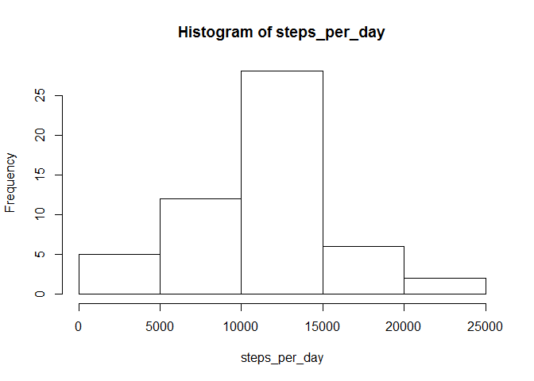

# Reproducible Research: Peer Assessment 1


## Loading and preprocessing the data
### Load required packages.

```r
require("sqldf")
```

```
## Loading required package: sqldf
## Loading required package: gsubfn
## Loading required package: proto
## Loading required package: RSQLite
## Loading required package: DBI
```

```r
require(ggplot2)
```

```
## Loading required package: ggplot2
```
### Download data.

```r
url <- "https://d396qusza40orc.cloudfront.net/repdata%2Fdata%2Factivity.zip"
file <- "activity.zip"
download.file(url, file)
```
### Decompress. 

```r
unzip(file, exdir = ".")
```
### Load into the data frame.

```r
row_data<-read.csv("activity.csv",stringsAsFactors=FALSE)
```

## What is mean total number of steps taken per day?
### In order to answer this question I will choose only complete cases from the raw data.

```r
good <- complete.cases(row_data)
good_data <- row_data[good,]
```
### The total number of steps taken per day I calculate using well known SQL language.

```r
steps_per_day<-sqldf("  select 
                        date,
                        sum(steps) as steps_per_day
                        from
                        good_data
                        group by
                        date")[,2]
```

```
## Loading required package: tcltk
```
### The mean of the total number of steps taken per day.

```r
mean(steps_per_day)
```

```
## [1] 10766.19
```
### And the median of the total number of steps taken per day.

```r
median(steps_per_day)
```

```
## [1] 10765
```
### In the end let`s make a histogram of the total number of steps taken each day.

```r
hist(steps_per_day)
```

 

## What is the average daily activity pattern?
### First of all I  calculate the average number of steps taken per interval.

```r
activity_patern<-sqldf("  select 
                        interval,
                        avg(steps) as avg_steps
                        from
                        good_data
                        group by
                        interval")
```
### Using this data I can make a time series plot of the 5-minute interval and the average number of steps taken, averaged across all days.

```r
qplot(interval,
      avg_steps,
      data=activity_patern,
      geom="line",
      ylab="Average number of steps taken in a 5-minute interval",
      xlab="Identifier for the 5-minute interval",
      main='The average number of steps taken in the 5-minute interval ')
```

 

### And the answer to the question, which 5-minute interval, on average across all the days in the dataset, contains the maximum number of steps.

```r
subset(activity_patern,avg_steps == max(activity_patern$avg_steps))
```

```
##     interval avg_steps
## 104      835  206.1698
```


## Imputing missing values
### In the beginning I calculate the total number of missing values in the dataset.

```r
NA_data <- row_data[!good,]
nrow(NA_data)
```

```
## [1] 2304
```
### Next I replace all of the missing values in the dataset with the rounded mean for that 5-minute interval. Create a new dataset that is equal to the original dataset but with the missing data filled in.

```r
NA_replace<-sqldf("  select 
                        a.avg_steps,
                        b.date,
                        b.interval
                        from
                        NA_data b,
                        activity_patern a
                        where
                        b.interval=a.interval")
NA_replace[,1] <- round(NA_replace[,1])
names(NA_replace)<-names(good_data)
NA_replaced_data<-rbind(good_data,NA_replace)
```
### Now I can calculate  the total number of steps taken per day for a new dataset.

```r
steps_per_day2<-sqldf(" select 
                        date,
                        sum(steps) as steps_per_day
                        from
                        NA_replaced_data
                        group by
                        date")[,2]
```
### Following that I calculate the mean total number of steps taken per day for a new dataset.

```r
mean(steps_per_day2)
```

```
## [1] 10765.64
```
### In the next step I calculate the median total number of steps taken per day for a new dataset.

```r
median(steps_per_day2)
```

```
## [1] 10762
```
### And finally a histogram of the total number of steps taken each day for a new dataset.

```r
hist(steps_per_day2)
```

 

### We can notice that the mean and the median calculated above for the dataset with the missing data filled in are slightly lower then the same calculated for the dataset without the missing data.

## Are there differences in activity patterns between weekdays and weekends?
### I create a new factor variable in the dataset with the number of week day.

```r
w_num<-as.integer(as.POSIXlt(as.Date(NA_replaced_data[,2],format="%Y-%m-%d"))$wday)
NA_replaced_data2<-cbind(NA_replaced_data,w_num)
```
### Next I calculate the average number of steps taken in the 5-minute interval, averaged across all weekdays  or weekend days.

```r
activity_patern2<-sqldf("select 
                        interval,
                        avg(steps) as avg_steps,
                        'weekend' as type_od_day
                        from
                        NA_replaced_data2
                        where
                        w_num in (0,6)
                        group by
                        interval
                        union all
                        select 
                        interval,
                        avg(steps) as avg_steps,
                        'weekday' as type_od_day
                        from
                        NA_replaced_data2
                        where
                        w_num not in (0,6)
                        group by
                        interval
                        ")
```
### Finally I make a panel plot containing the average number of steps taken in the 5-minute interval according to the type of day.

```r
qplot(interval,
      avg_steps,
      data=activity_patern2,
      geom="line",
      facets=.~type_od_day,
      ylab="Average number of steps taken in a 5-minute interval",
      xlab="Identifier for the 5-minute interval",
      main='The average number of steps taken in the 5-minute interval
      according to the type of day')
```

 

### As presented, there are different activity patterns on weekdays and weekends. Maximal average number of steps taken in the 5 - minute interval is higher on weekdays. However at the weekends people start their activity later, but it lasts longer and on more stable level than during weekdays.
